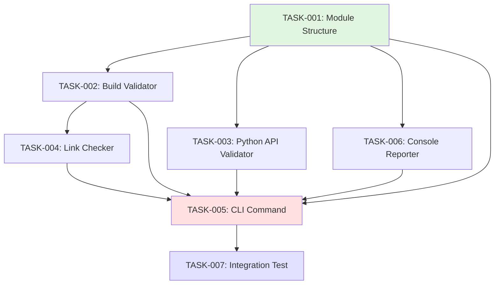

# Phase 1 Implementation Plan: Core Validation (Week 1)

## Executive Summary

Phase 1 establishes the foundation for documentation validation by implementing core validators, the CLI command interface, and console reporting. This plan breaks down 7 major tasks from VALIDATION_PLAN.md into specific implementation steps with time estimates and dependency tracking.

**Timeline**: 5 working days (40 hours total)
**Goal**: Enable basic documentation validation with `python_docs_init validate` command
**Success Criteria**: Can validate python_picotool repository and generate actionable console reports

---

## File Structure to Create

```
packages/python_docs_init/
├── validate.py                      # Main validation orchestration
├── validators/
│   ├── __init__.py                  # Validator exports
│   ├── base.py                      # Base validator classes and types
│   ├── build.py                     # mkdocs build --strict validation
│   ├── python_api.py                # Python docstring validation via griffe
│   ├── links.py                     # Internal link checking
│   └── coverage.py                  # Coverage aggregation utilities
├── reporters/
│   ├── __init__.py                  # Reporter exports
│   ├── base.py                      # Base reporter interface
│   └── console.py                   # Rich console reporter
├── templates/
│   └── (existing templates remain)  # No changes to templates in Phase 1
└── tests/
    ├── validators/
    │   ├── __init__.py
    │   ├── test_build.py
    │   ├── test_python_api.py
    │   ├── test_links.py
    │   └── test_coverage.py
    ├── reporters/
    │   ├── __init__.py
    │   └── test_console.py
    ├── fixtures/
    │   ├── complete_project/        # 100% coverage test project
    │   ├── minimal_project/          # Bare minimum test project
    │   └── missing_python_docs/      # Missing docstrings test project
    └── test_validate.py              # Integration tests for validate command
```

---

## Dependencies to Add

### pyproject.toml Updates

Add to `[project.optional-dependencies]`:

```toml
[project.optional-dependencies]
validation = [
    "griffe>=1.0.0",          # Python API introspection (mkdocstrings engine)
    "interrogate>=1.7.0",     # Docstring coverage measurement
    "beautifulsoup4>=4.12.0", # HTML parsing for link checking
    "lxml>=5.0.0",            # XML parsing (BeautifulSoup backend)
]
```

**Rationale**:

- `griffe`: Same engine as mkdocstrings, ensures consistency with generated docs
- `interrogate`: Industry-standard docstring coverage tool, CLI-friendly
- `beautifulsoup4` + `lxml`: Robust HTML parsing for link validation
- **Deferred to Phase 2**: `watchdog` (watch mode), Doxygen XML parsing

**Installation Command**:

```bash
uv sync --extra validation
```

---

## Task Breakdown with Time Estimates

### TASK-001: Create Validation Module Structure (4 hours)

**Priority**: P0 (Blocker for all other tasks)
**Estimated Time**: 4 hours
**Dependencies**: None

**Subtasks**:

1. Create directory structure (30 min)
   - Create `validators/` directory
   - Create `reporters/` directory
   - Create `tests/validators/` and `tests/reporters/`
   - Create `tests/fixtures/` directories

2. Implement base types and classes (2 hours)
   - Create `validators/base.py` with:
     - `ValidationResult` dataclass (status, errors, warnings, metadata)
     - `ValidationCheck` Protocol (define validator interface)
     - `ValidationStatus` Enum (PASS, WARNING, FAIL)
   - Create `reporters/base.py` with:
     - `Reporter` Protocol (abstract reporter interface)
     - `ReportFormat` Enum (console, json, junit, markdown)

3. Create `validate.py` orchestration module (1 hour)
   - Function: `validate_documentation(repo_path: Path, checks: list[str]) -> ValidationResult`
   - Aggregation logic for multiple validators
   - Error handling and result merging

4. Add `__init__.py` exports (30 min)
   - Export validator classes
   - Export reporter classes
   - Export base types

**Acceptance Criteria**:

- Directory structure exists
- Base types are importable: `from python_docs_init.validators.base import ValidationResult`
- All type hints pass `mypy --strict`
- 100% test coverage for base types

**Testing Strategy**:

```python
def test_validation_result_creation():
    """Test ValidationResult can be created with all fields."""
    result = ValidationResult(
        status=ValidationStatus.PASS,
        errors=[],
        warnings=["Minor issue"],
        metadata={"coverage": 85.0}
    )
    assert result.status == ValidationStatus.PASS
    assert len(result.warnings) == 1

def test_validation_check_protocol():
    """Test that custom validators can implement the Protocol."""
    class CustomValidator:
        def validate(self, repo_path: Path) -> ValidationResult:
            return ValidationResult(status=ValidationStatus.PASS)

    # Should type-check as ValidationCheck
    validator: ValidationCheck = CustomValidator()
```

---

### TASK-002: Implement Build Validator (6 hours)

**Priority**: P0 (Core functionality)
**Estimated Time**: 6 hours
**Dependencies**: TASK-001

**Subtasks**:

1. Create `validators/build.py` (3 hours)
   - Function: `validate_build(repo_path: Path) -> ValidationResult`
   - Run `mkdocs build --strict` via subprocess
   - Parse stdout/stderr for errors and warnings
   - Measure build duration
   - Check that `site/` directory was created
   - Verify critical HTML files exist (index.html, API reference pages)

2. Error parsing and categorization (2 hours)
   - Parse mkdocs error messages:
     - "ERROR - Config value: ..." → configuration errors
     - "WARNING - Doc file ..." → missing file warnings
     - "ERROR - Could not find ..." → broken link errors
   - Categorize by severity (error vs warning)
   - Extract line numbers and file paths where available

3. Result formatting (1 hour)
   - Populate `ValidationResult.metadata` with:
     - `build_duration`: float (seconds)
     - `error_count`: int
     - `warning_count`: int
     - `errors`: list of error messages with context
     - `warnings`: list of warning messages with context

**Implementation Notes**:

```python
def validate_build(repo_path: Path) -> ValidationResult:
    """Validate that mkdocs build succeeds with --strict mode.

    Runs mkdocs build --strict and parses output for errors/warnings.

    Args:
        repo_path: Path to repository with mkdocs.yml

    Returns:
        ValidationResult with build status and diagnostics
    """
    start_time = time.time()

    result = subprocess.run(
        ["mkdocs", "build", "--strict"],
        cwd=repo_path,
        capture_output=True,
        text=True,
    )

    duration = time.time() - start_time

    # Parse output for errors/warnings
    errors, warnings = _parse_build_output(result.stdout, result.stderr)

    status = ValidationStatus.PASS if result.returncode == 0 else ValidationStatus.FAIL

    return ValidationResult(
        status=status,
        errors=errors,
        warnings=warnings,
        metadata={
            "build_duration": duration,
            "error_count": len(errors),
            "warning_count": len(warnings),
        }
    )
```

**Acceptance Criteria**:

- Successfully detects mkdocs build failures
- Parses and categorizes errors vs warnings
- Reports build duration
- Handles missing mkdocs.yml gracefully (returns FAIL with clear error)
- Works with real python_picotool repository

**Testing Strategy**:

```python
def test_build_validator_success(tmp_path):
    """Test build validator with valid mkdocs project."""
    # Create minimal valid mkdocs.yml
    setup_valid_mkdocs_project(tmp_path)

    result = validate_build(tmp_path)

    assert result.status == ValidationStatus.PASS
    assert result.metadata["error_count"] == 0
    assert result.metadata["build_duration"] > 0

def test_build_validator_missing_config(tmp_path):
    """Test build validator with missing mkdocs.yml."""
    result = validate_build(tmp_path)

    assert result.status == ValidationStatus.FAIL
    assert "mkdocs.yml" in result.errors[0]

def test_build_validator_broken_link(tmp_path):
    """Test build validator detects broken internal links."""
    setup_mkdocs_project_with_broken_link(tmp_path)

    result = validate_build(tmp_path)

    assert result.status == ValidationStatus.FAIL
    assert any("Could not find" in error for error in result.errors)
```

---

### TASK-003: Implement Python API Validator (8 hours)

**Priority**: P0 (Core functionality)
**Estimated Time**: 8 hours
**Dependencies**: TASK-001

**Subtasks**:

1. Implement griffe-based introspection (4 hours)
   - Use `griffe.load()` to load Python package
   - Traverse module tree to find all public functions/classes/methods
   - Extract docstring presence and quality
   - Check for type hints on parameters and return values
   - Validate docstring format (Google-style expected)

2. Implement interrogate integration (2 hours)
   - Run `interrogate --verbose` to get detailed coverage report
   - Parse JSON output (use `--format json` flag)
   - Extract coverage percentage and missing items
   - Cross-reference with griffe results for consistency

3. Missing docstring detection (2 hours)
   - Identify undocumented public functions
   - Identify undocumented classes
   - Identify undocumented methods
   - Report file path and line number for each missing docstring
   - Generate actionable fix suggestions

**Implementation Notes**:

```python
def validate_python_api(repo_path: Path, package_name: str) -> ValidationResult:
    """Validate Python API documentation coverage.

    Uses griffe to introspect package and interrogate for coverage metrics.

    Args:
        repo_path: Path to repository root
        package_name: Name of Python package to validate (e.g., "python_picotool")

    Returns:
        ValidationResult with coverage metrics and missing items
    """
    import griffe
    from interrogate import coverage as interrogate_coverage

    # Load package with griffe
    package = griffe.load(package_name, search_paths=[repo_path])

    # Traverse and collect documentation status
    missing_items = []
    total_items = 0
    documented_items = 0

    for member in package.members.values():
        if _is_public(member):
            total_items += 1
            if member.docstring:
                documented_items += 1
            else:
                missing_items.append({
                    "path": member.path,
                    "line": member.lineno,
                    "type": member.kind.value,
                })

    coverage = (documented_items / total_items * 100) if total_items > 0 else 0.0

    # Determine status based on threshold (80% minimum)
    status = ValidationStatus.PASS if coverage >= 80.0 else ValidationStatus.WARNING

    return ValidationResult(
        status=status,
        errors=[],
        warnings=[f"Missing docstring: {item['path']} (line {item['line']})"
                  for item in missing_items],
        metadata={
            "coverage": coverage,
            "documented": documented_items,
            "total": total_items,
            "missing": missing_items,
        }
    )
```

**Acceptance Criteria**:

- Accurately counts public functions/classes/methods
- Correctly identifies missing docstrings
- Reports coverage percentage
- Provides file path and line number for missing items
- Handles edge cases (empty packages, **init**.py only)
- Coverage threshold configurable (default 80%)

**Testing Strategy**:

```python
def test_python_api_validator_full_coverage(tmp_path):
    """Test validator with 100% documented package."""
    create_fully_documented_package(tmp_path, "test_pkg")

    result = validate_python_api(tmp_path, "test_pkg")

    assert result.status == ValidationStatus.PASS
    assert result.metadata["coverage"] == 100.0
    assert len(result.warnings) == 0

def test_python_api_validator_missing_docstrings(tmp_path):
    """Test validator detects missing docstrings."""
    create_package_with_missing_docs(tmp_path, "test_pkg")

    result = validate_python_api(tmp_path, "test_pkg")

    assert result.status == ValidationStatus.WARNING
    assert result.metadata["coverage"] < 80.0
    assert len(result.warnings) > 0
    assert "test_pkg.module.undocumented_func" in result.warnings[0]

def test_python_api_validator_type_hints(tmp_path):
    """Test validator checks for type hints."""
    create_package_without_type_hints(tmp_path, "test_pkg")

    result = validate_python_api(tmp_path, "test_pkg")

    # Should warn about missing type hints
    assert any("type hint" in w.lower() for w in result.warnings)
```

---

### TASK-004: Implement Basic Link Checker (6 hours)

**Priority**: P1 (Important but not blocking)
**Estimated Time**: 6 hours
**Dependencies**: TASK-002 (needs built site/)

**Subtasks**:

1. HTML parsing with BeautifulSoup (2 hours)
   - Parse all HTML files in `site/` directory
   - Extract all `<a href="...">` links
   - Extract all `` image references
   - Handle relative and absolute URLs

2. Internal link validation (3 hours)
   - For each internal link, verify target file exists
   - Check for fragment identifiers (#section-name)
   - Validate that fragments exist in target HTML
   - Report broken links with source and target paths

3. Navigation structure validation (1 hour)
   - Parse `mkdocs.yml` nav structure
   - Verify all nav items point to existing .md files
   - Check for orphaned .md files not in nav

**Implementation Notes**:

```python
def validate_links(repo_path: Path) -> ValidationResult:
    """Validate internal links in built documentation.

    Parses HTML files in site/ and checks that all internal links resolve.

    Args:
        repo_path: Path to repository with built site/ directory

    Returns:
        ValidationResult with broken link details
    """
    from bs4 import BeautifulSoup

    site_dir = repo_path / "site"
    if not site_dir.exists():
        return ValidationResult(
            status=ValidationStatus.FAIL,
            errors=["site/ directory not found. Run mkdocs build first."],
            warnings=[],
            metadata={}
        )

    broken_links = []

    for html_file in site_dir.rglob("*.html"):
        soup = BeautifulSoup(html_file.read_text(), "lxml")

        for link in soup.find_all("a", href=True):
            href = link["href"]

            # Skip external links
            if href.startswith("http"):
                continue

            # Resolve relative link
            target = _resolve_link(html_file, href, site_dir)

            if not target.exists():
                broken_links.append({
                    "source": str(html_file.relative_to(site_dir)),
                    "link": href,
                    "target": str(target),
                })

    status = ValidationStatus.PASS if len(broken_links) == 0 else ValidationStatus.WARNING

    return ValidationResult(
        status=status,
        errors=[],
        warnings=[f"Broken link in {link['source']}: {link['link']}"
                  for link in broken_links],
        metadata={
            "broken_links": broken_links,
            "broken_count": len(broken_links),
        }
    )
```

**Acceptance Criteria**:

- Detects broken internal links
- Handles fragment identifiers (#anchors)
- Reports source file and broken link
- Skips external links (http/https)
- Handles edge cases (missing site/ directory, malformed HTML)

**Testing Strategy**:

```python
def test_link_validator_no_broken_links(tmp_path):
    """Test validator with all valid links."""
    setup_valid_mkdocs_site(tmp_path)

    result = validate_links(tmp_path)

    assert result.status == ValidationStatus.PASS
    assert result.metadata["broken_count"] == 0

def test_link_validator_broken_link(tmp_path):
    """Test validator detects broken internal link."""
    setup_site_with_broken_link(tmp_path)

    result = validate_links(tmp_path)

    assert result.status == ValidationStatus.WARNING
    assert result.metadata["broken_count"] > 0
    assert "nonexistent.html" in result.warnings[0]

def test_link_validator_fragment_validation(tmp_path):
    """Test validator checks fragment identifiers."""
    setup_site_with_invalid_fragment(tmp_path)

    result = validate_links(tmp_path)

    assert result.status == ValidationStatus.WARNING
    assert "#missing-section" in result.warnings[0]
```

---

### TASK-005: Add validate Command to CLI (4 hours)

**Priority**: P0 (User interface)
**Estimated Time**: 4 hours
**Dependencies**: TASK-001, TASK-002, TASK-003, TASK-004

**Subtasks**:

1. Expand existing `validate()` command in `cli.py` (2 hours)
   - Remove placeholder implementation
   - Add command options:
     - `--check`: Specific check to run (all, build, python, links)
     - `--format`: Output format (console only in Phase 1)
     - `--strict`: Fail on warnings
     - `--min-python-coverage`: Python coverage threshold
   - Call appropriate validators based on options
   - Aggregate results

2. Error handling and exit codes (1 hour)
   - Exit code 0: All checks pass
   - Exit code 1: Any check fails (errors)
   - Exit code 2: Warnings present (only in --strict mode)
   - Proper exception handling for missing dependencies

3. Integration with validation orchestrator (1 hour)
   - Call `validate_documentation()` from `validate.py`
   - Pass configuration from CLI options
   - Format results with console reporter

**Implementation Notes**:

```python
@app.command()
def validate(
    repo_path: Annotated[
        Path,
        typer.Argument(
            help="Path to Python repository to validate documentation for",
            exists=True,
            file_okay=False,
            dir_okay=True,
            resolve_path=True,
        ),
    ],
    check: Annotated[
        str,
        typer.Option(
            "--check",
            help="Specific check to run: all, build, python, links",
        ),
    ] = "all",
    format: Annotated[
        str,
        typer.Option(
            "--format",
            help="Output format: console, json (Phase 1: console only)",
        ),
    ] = "console",
    strict: Annotated[
        bool,
        typer.Option(
            "--strict",
            help="Fail on warnings (exit code 2)",
        ),
    ] = False,
    min_python_coverage: Annotated[
        int,
        typer.Option(
            "--min-python-coverage",
            help="Minimum Python API coverage threshold (0-100)",
        ),
    ] = 80,
) -> None:
    """Validate documentation setup and quality.

    Runs comprehensive checks on documentation including build validation,
    API coverage, and link checking.
    """
    from python_docs_init.validate import validate_documentation
    from python_docs_init.reporters.console import ConsoleReporter

    try:
        # Run validation
        result = validate_documentation(
            repo_path,
            checks=check.split(",") if "," in check else [check],
            min_python_coverage=min_python_coverage,
        )

        # Generate report
        reporter = ConsoleReporter()
        reporter.report(result)

        # Determine exit code
        if result.has_errors():
            raise typer.Exit(1)
        elif strict and result.has_warnings():
            raise typer.Exit(2)
        else:
            raise typer.Exit(0)

    except FileNotFoundError as e:
        handle_error(e, f"Validation failed: {e}")
    except Exception as e:
        handle_error(e, f"Validation error: {e}")
```

**Acceptance Criteria**:

- Command `python_docs_init validate .` works
- `--check` option filters which validators run
- `--strict` mode causes warnings to fail the build
- `--min-python-coverage` configures threshold
- Clear error messages for missing dependencies
- Proper exit codes (0=success, 1=errors, 2=warnings in strict)

**Testing Strategy**:

```python
def test_validate_command_success(cli_runner, tmp_path):
    """Test validate command with passing repository."""
    setup_valid_repository(tmp_path)

    result = cli_runner.invoke(app, ["validate", str(tmp_path)])

    assert result.exit_code == 0
    assert "PASS" in result.stdout

def test_validate_command_with_errors(cli_runner, tmp_path):
    """Test validate command with failing repository."""
    setup_repository_with_errors(tmp_path)

    result = cli_runner.invoke(app, ["validate", str(tmp_path)])

    assert result.exit_code == 1
    assert "FAIL" in result.stdout

def test_validate_command_strict_mode(cli_runner, tmp_path):
    """Test validate command --strict fails on warnings."""
    setup_repository_with_warnings(tmp_path)

    result = cli_runner.invoke(app, ["validate", str(tmp_path), "--strict"])

    assert result.exit_code == 2
```

---

### TASK-006: Create Console Reporter with Rich (6 hours)

**Priority**: P0 (User experience)
**Estimated Time**: 6 hours
**Dependencies**: TASK-001

**Subtasks**:

1. Implement ConsoleReporter class (3 hours)
   - Implement `Reporter` Protocol
   - Format validation results with Rich components
   - Use Rich Table for structured output
   - Use Rich Panel for sections
   - Color-coded status indicators (✅ PASS, ⚠️ WARNING, ❌ FAIL)

2. Create detailed error/warning formatting (2 hours)
   - Show file paths with line numbers
   - Syntax highlight code snippets where applicable
   - Provide "Quick fix" suggestions
   - Example fix code blocks

3. Add summary section (1 hour)
   - Overall status
   - Check breakdown (X/Y checks passed)
   - Coverage summary
   - Next steps and recommendations

**Implementation Notes**:

```python
from rich.console import Console
from rich.table import Table
from rich.panel import Panel
from rich.syntax import Syntax

class ConsoleReporter:
    """Rich console reporter for validation results."""

    def __init__(self):
        self.console = Console()

    def report(self, result: ValidationResult) -> None:
        """Generate and print console report.

        Args:
            result: Aggregated validation result to report
        """
        self.console.print("\n")
        self.console.print(
            Panel(
                "[bold cyan]Documentation Validation Report[/bold cyan]",
                border_style="cyan"
            )
        )

        # Build status section
        self._report_build_status(result.checks.get("build"))

        # Python API section
        self._report_python_api(result.checks.get("python_api"))

        # Links section
        self._report_links(result.checks.get("links"))

        # Overall summary
        self._report_summary(result)

    def _report_build_status(self, build_result: ValidationResult | None) -> None:
        """Report mkdocs build validation results."""
        if not build_result:
            return

        status_icon = "✅" if build_result.status == ValidationStatus.PASS else "❌"

        self.console.print(f"\n{status_icon} [bold]Build Status:[/bold] {build_result.status.value}")

        if build_result.metadata:
            duration = build_result.metadata.get("build_duration", 0)
            errors = build_result.metadata.get("error_count", 0)
            warnings = build_result.metadata.get("warning_count", 0)

            self.console.print(f"   - mkdocs build completed in {duration:.2f}s")
            self.console.print(f"   - {errors} errors, {warnings} warnings")

        # Show errors/warnings
        if build_result.errors:
            self.console.print("\n   [red]Errors:[/red]")
            for error in build_result.errors[:5]:  # Limit to first 5
                self.console.print(f"     • {error}")

        if build_result.warnings:
            self.console.print("\n   [yellow]Warnings:[/yellow]")
            for warning in build_result.warnings[:5]:
                self.console.print(f"     • {warning}")

    def _report_python_api(self, python_result: ValidationResult | None) -> None:
        """Report Python API documentation coverage."""
        if not python_result:
            return

        status_icon = "✅" if python_result.status == ValidationStatus.PASS else "⚠️"
        coverage = python_result.metadata.get("coverage", 0.0)

        self.console.print(f"\n{status_icon} [bold]Python API Documentation:[/bold] {coverage:.1f}% coverage")

        documented = python_result.metadata.get("documented", 0)
        total = python_result.metadata.get("total", 0)
        self.console.print(f"   - {documented}/{total} public functions documented")

        # Show missing items
        missing = python_result.metadata.get("missing", [])
        if missing:
            self.console.print(f"\n   [yellow]Missing docstrings: {len(missing)} functions[/yellow]")
            for item in missing[:5]:
                self.console.print(f"     • {item['path']} [line {item['line']}]")

            if len(missing) > 5:
                self.console.print(f"     ... and {len(missing) - 5} more")

            # Quick fix suggestion
            self.console.print("\n   [cyan]Quick fix:[/cyan]")
            self.console.print("     uv run interrogate -v packages/your_package")
```

**Acceptance Criteria**:

- Clear, readable console output with Rich formatting
- Status indicators (✅ ⚠️ ❌) for each check
- Errors and warnings clearly separated
- File paths and line numbers for missing items
- Quick fix suggestions provided
- Overall summary at the end
- Output respects NO_COLOR environment variable

**Testing Strategy**:

```python
def test_console_reporter_pass_status(capsys):
    """Test console reporter with passing validation."""
    result = ValidationResult(status=ValidationStatus.PASS)
    reporter = ConsoleReporter()

    reporter.report(result)

    captured = capsys.readouterr()
    assert "✅" in captured.out or "PASS" in captured.out

def test_console_reporter_warnings(capsys):
    """Test console reporter displays warnings."""
    result = ValidationResult(
        status=ValidationStatus.WARNING,
        warnings=["Missing docstring in module.py line 45"]
    )
    reporter = ConsoleReporter()

    reporter.report(result)

    captured = capsys.readouterr()
    assert "Warning" in captured.out
    assert "module.py" in captured.out
    assert "45" in captured.out

def test_console_reporter_quick_fix(capsys):
    """Test console reporter provides quick fix suggestions."""
    result = create_result_with_missing_docs()
    reporter = ConsoleReporter()

    reporter.report(result)

    captured = capsys.readouterr()
    assert "Quick fix" in captured.out
    assert "interrogate" in captured.out
```

---

### TASK-007: Test on python_picotool (6 hours)

**Priority**: P0 (Integration validation)
**Estimated Time**: 6 hours
**Dependencies**: TASK-001, TASK-002, TASK-003, TASK-004, TASK-005, TASK-006

**Subtasks**:

1. Set up python_picotool test environment (1 hour)
   - Clone python_picotool repository
   - Install dependencies with `uv sync --extra docs --extra validation`
   - Ensure mkdocs builds successfully

2. Run validation and analyze results (2 hours)
   - Execute `python_docs_init validate /path/to/python_picotool`
   - Capture output and analyze
   - Verify all validators run successfully
   - Check that coverage metrics are accurate
   - Validate link checking finds real issues

3. Fix issues found during testing (2 hours)
   - Debug any validator failures
   - Fix false positives in link checking
   - Adjust coverage thresholds if needed
   - Handle edge cases discovered

4. Document findings and create test fixtures (1 hour)
   - Document python_picotool validation baseline
   - Extract minimal examples for test fixtures
   - Add integration test using python_picotool structure

**Acceptance Criteria**:

- Validation runs successfully on python_picotool
- Results are accurate and actionable
- No false positives or false negatives
- Performance is acceptable (< 10 seconds total)
- Console output is clear and helpful

**Testing Strategy**:

```python
def test_validate_python_picotool_integration():
    """Integration test with real python_picotool repository."""
    # Assumes python_picotool is available
    picotool_path = Path("/path/to/python_picotool")

    if not picotool_path.exists():
        pytest.skip("python_picotool not available")

    result = validate_documentation(picotool_path)

    # Should complete without errors
    assert result is not None

    # Should have all expected checks
    assert "build" in result.checks
    assert "python_api" in result.checks
    assert "links" in result.checks

    # Build should pass (mkdocs.yml exists)
    assert result.checks["build"].status in [ValidationStatus.PASS, ValidationStatus.WARNING]
```

---

## Implementation Order (Dependency Graph)



**Critical Path**: TASK-001 → TASK-002/003/006 → TASK-005 → TASK-007

**Parallel Opportunities**:

- TASK-002, TASK-003, and TASK-006 can be implemented in parallel after TASK-001
- TASK-004 can start after TASK-002 is complete

---

## Daily Schedule

### Day 1 (Monday): Foundation

- **Morning**: TASK-001 (Module Structure) - 4 hours
- **Afternoon**: Start TASK-002 (Build Validator) - 4 hours
- **End of Day**: Module structure complete, build validator in progress

### Day 2 (Tuesday): Core Validators

- **Morning**: Finish TASK-002 (Build Validator) - 2 hours
- **Afternoon**: TASK-003 (Python API Validator) - 6 hours
- **End of Day**: Build and Python validators complete

### Day 3 (Wednesday): Links and Reporting

- **Morning**: TASK-006 (Console Reporter) - 6 hours
- **Afternoon**: TASK-004 (Link Checker) - 2 hours
- **End of Day**: Reporter and link checker in progress

### Day 4 (Thursday): Integration

- **Morning**: Finish TASK-004 (Link Checker) - 4 hours
- **Afternoon**: TASK-005 (CLI Command) - 4 hours
- **End of Day**: All validators integrated into CLI

### Day 5 (Friday): Testing and Polish

- **Morning**: TASK-007 (Integration Testing) - 4 hours
- **Afternoon**: Bug fixes, documentation, code review - 4 hours
- **End of Day**: Phase 1 complete and tested

---

## Testing Approach for Each Validator

### General Testing Principles

1. **Test Fixture Strategy**:
   - Create minimal reproducible test projects in `tests/fixtures/`
   - Use real directory structures with actual Python files
   - Include both positive (valid) and negative (invalid) cases
   - Make fixtures reusable across multiple test modules

2. **Test Categories**:
   - **Unit Tests**: Test individual validator functions in isolation
   - **Integration Tests**: Test validators against real project structures
   - **CLI Tests**: Test command-line interface with `typer.testing.CliRunner`
   - **Regression Tests**: Test against python_picotool to prevent regressions

3. **Coverage Target**: 80% minimum, 95%+ for core validation logic

### Validator-Specific Testing

#### Build Validator Testing

```python
# tests/validators/test_build.py

def test_build_validator_success(tmp_path):
    """Test with valid mkdocs project that builds successfully."""
    setup_valid_mkdocs_project(tmp_path)
    result = validate_build(tmp_path)
    assert result.status == ValidationStatus.PASS

def test_build_validator_missing_config(tmp_path):
    """Test with missing mkdocs.yml."""
    result = validate_build(tmp_path)
    assert result.status == ValidationStatus.FAIL
    assert "mkdocs.yml" in result.errors[0]

def test_build_validator_warning_handling(tmp_path):
    """Test that warnings don't cause failure but are reported."""
    setup_mkdocs_with_warnings(tmp_path)
    result = validate_build(tmp_path)
    assert result.status == ValidationStatus.PASS
    assert len(result.warnings) > 0
```

#### Python API Validator Testing

```python
# tests/validators/test_python_api.py

def test_python_api_validator_full_coverage(tmp_path):
    """Test with 100% documented package."""
    create_package(tmp_path, "test_pkg", coverage=100)
    result = validate_python_api(tmp_path, "test_pkg")
    assert result.metadata["coverage"] == 100.0

def test_python_api_validator_partial_coverage(tmp_path):
    """Test with partially documented package."""
    create_package(tmp_path, "test_pkg", coverage=60)
    result = validate_python_api(tmp_path, "test_pkg")
    assert result.status == ValidationStatus.WARNING
    assert 55 <= result.metadata["coverage"] <= 65

def test_python_api_validator_private_members_excluded(tmp_path):
    """Test that private functions (_func) are excluded from coverage."""
    create_package_with_private_functions(tmp_path, "test_pkg")
    result = validate_python_api(tmp_path, "test_pkg")
    # Private functions should not affect coverage
    assert result.metadata["total"] == count_public_only(tmp_path)
```

#### Link Checker Testing

```python
# tests/validators/test_links.py

def test_link_validator_all_valid(tmp_path):
    """Test with all valid internal links."""
    setup_site_with_valid_links(tmp_path)
    result = validate_links(tmp_path)
    assert result.status == ValidationStatus.PASS

def test_link_validator_broken_link(tmp_path):
    """Test detection of broken internal link."""
    setup_site_with_broken_link(tmp_path, broken_link="nonexistent.html")
    result = validate_links(tmp_path)
    assert result.status == ValidationStatus.WARNING
    assert "nonexistent.html" in result.warnings[0]

def test_link_validator_external_links_skipped(tmp_path):
    """Test that external links are not validated in Phase 1."""
    setup_site_with_external_links(tmp_path)
    result = validate_links(tmp_path)
    # Should not report external links as broken
    assert result.status == ValidationStatus.PASS
```

#### Console Reporter Testing

```python
# tests/reporters/test_console.py

def test_console_reporter_formatting(capsys):
    """Test that output uses Rich formatting."""
    result = create_sample_validation_result()
    reporter = ConsoleReporter()
    reporter.report(result)

    output = capsys.readouterr().out
    assert "Documentation Validation Report" in output

def test_console_reporter_no_color_support(capsys, monkeypatch):
    """Test that NO_COLOR environment variable disables formatting."""
    monkeypatch.setenv("NO_COLOR", "1")
    result = create_sample_validation_result()
    reporter = ConsoleReporter()
    reporter.report(result)

    output = capsys.readouterr().out
    # Should not contain ANSI escape codes
    assert "\x1b[" not in output
```

---

## Risk Assessment and Mitigation

### Technical Risks

1. **Risk**: griffe may fail to load certain package structures
   - **Likelihood**: Medium
   - **Impact**: High
   - **Mitigation**: Add try/except handling, provide clear error messages, test with multiple package layouts

2. **Risk**: mkdocs build may hang or take too long
   - **Likelihood**: Low
   - **Impact**: Medium
   - **Mitigation**: Add timeout to subprocess.run(), provide progress indication

3. **Risk**: Link checking may produce false positives
   - **Likelihood**: Medium
   - **Impact**: Medium
   - **Mitigation**: Comprehensive testing with real projects, allow link exclusion patterns

4. **Risk**: Dependencies (griffe, interrogate) may have version conflicts
   - **Likelihood**: Low
   - **Impact**: High
   - **Mitigation**: Pin versions in pyproject.toml, test with uv lock

### Process Risks

1. **Risk**: Scope creep (adding Phase 2 features to Phase 1)
   - **Likelihood**: High
   - **Impact**: Medium
   - **Mitigation**: Strict adherence to Phase 1 task list, defer C API and CLI validation to Phase 2

2. **Risk**: Integration testing reveals fundamental design issues
   - **Likelihood**: Medium
   - **Impact**: High
   - **Mitigation**: Early integration testing (Day 3), design reviews before implementation

---

## Success Criteria

Phase 1 is considered complete when:

1. ✅ All 7 tasks implemented and tested
2. ✅ `python_docs_init validate .` command works end-to-end
3. ✅ Build validator detects mkdocs build failures
4. ✅ Python API validator reports accurate coverage (±5%)
5. ✅ Link checker detects broken internal links
6. ✅ Console reporter produces clear, actionable output
7. ✅ Test coverage ≥80% for validation modules
8. ✅ Successfully validates python_picotool repository
9. ✅ All dependencies install cleanly with `uv sync --extra validation`
10. ✅ Documentation updated with validation command usage

---

## Next Steps (Phase 2 Preview)

After Phase 1 completion, Phase 2 will add:

- C API validator with Doxygen XML parsing
- CLI validator using Typer introspection
- Supporting docs checker (install.md, contributing.md, etc.)
- JSON and JUnit reporters for CI/CD integration
- Configuration via `pyproject.toml`
- Watch mode for continuous validation

---

## Appendix: Example Test Fixtures

### Fixture: Complete Project (100% Coverage)

```
tests/fixtures/complete_project/
├── pyproject.toml
├── mkdocs.yml
├── docs/
│   └── index.md
├── site/
│   └── index.html
└── src/
    └── complete_pkg/
        ├── __init__.py
        └── module.py

# src/complete_pkg/module.py
"""Fully documented module."""

def public_function(param: str) -> str:
    """Fully documented function.

    Args:
        param: Description of parameter

    Returns:
        Description of return value
    """
    return param

class PublicClass:
    """Fully documented class."""

    def method(self) -> None:
        """Fully documented method."""
        pass
```

### Fixture: Missing Python Docs

```
tests/fixtures/missing_python_docs/
└── src/
    └── incomplete_pkg/
        ├── __init__.py
        └── module.py

# src/incomplete_pkg/module.py
"""Module with missing docstrings."""

def documented_function(param: str) -> str:
    """This function is documented."""
    return param

def undocumented_function(param):  # Missing docstring and type hints
    return param

class UndocumentedClass:  # Missing class docstring
    def undocumented_method(self):  # Missing method docstring
        pass
```

---

## File Count Summary

**New Files**: 23

- **Validators**: 5 files (base.py, build.py, python_api.py, links.py, coverage.py)
- **Reporters**: 2 files (base.py, console.py)
- **Core**: 1 file (validate.py)
- **Tests**: 12 files (test files + fixtures)
- **Modified**: 2 files (cli.py, pyproject.toml)

**Lines of Code Estimate**: ~2,000 lines total

- Validators: ~800 lines
- Reporters: ~400 lines
- Tests: ~600 lines
- Fixtures: ~200 lines

---

**Document Version**: 1.0
**Created**: 2025-10-26
**Phase**: Phase 1 - Core Validation (Week 1)
**Status**: Ready for Implementation
