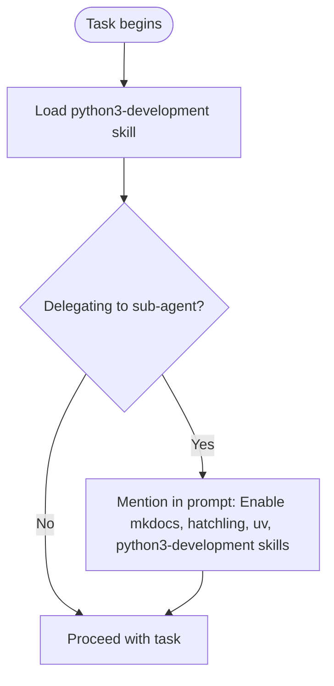
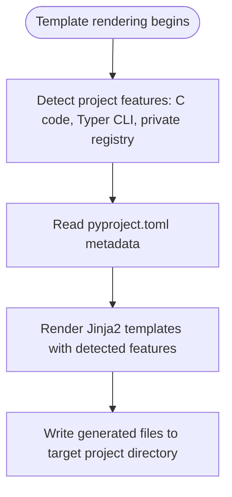
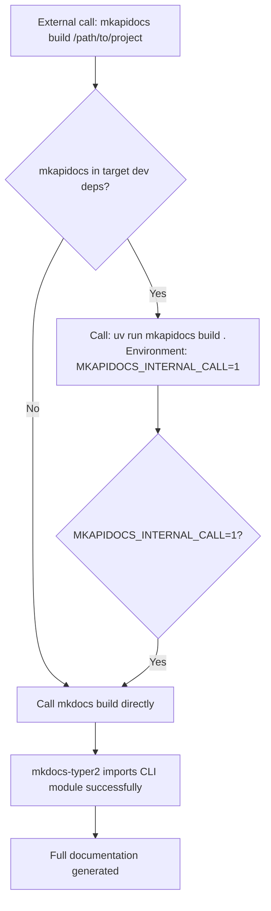
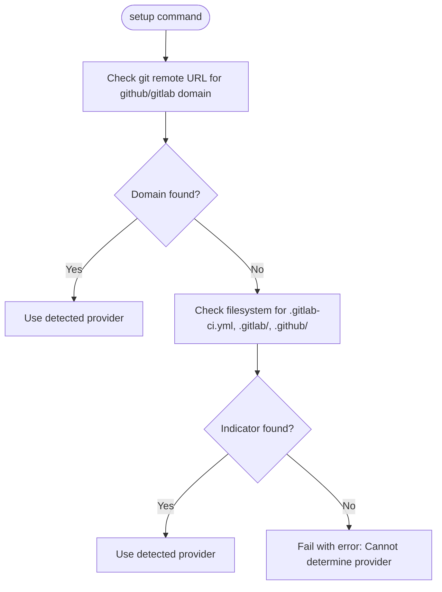
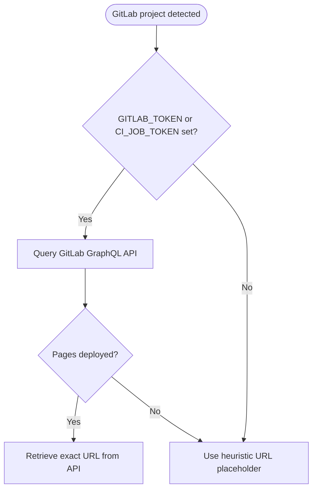
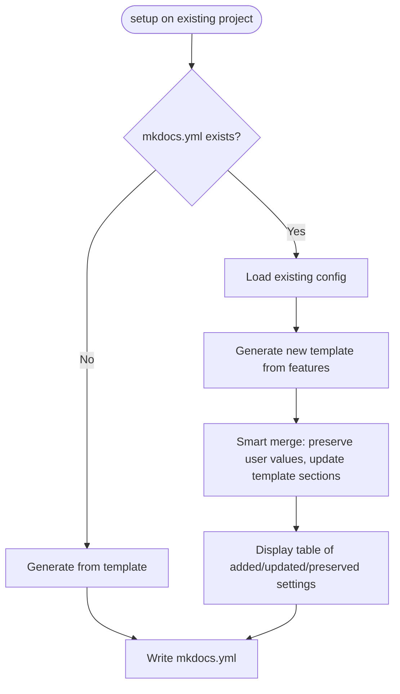
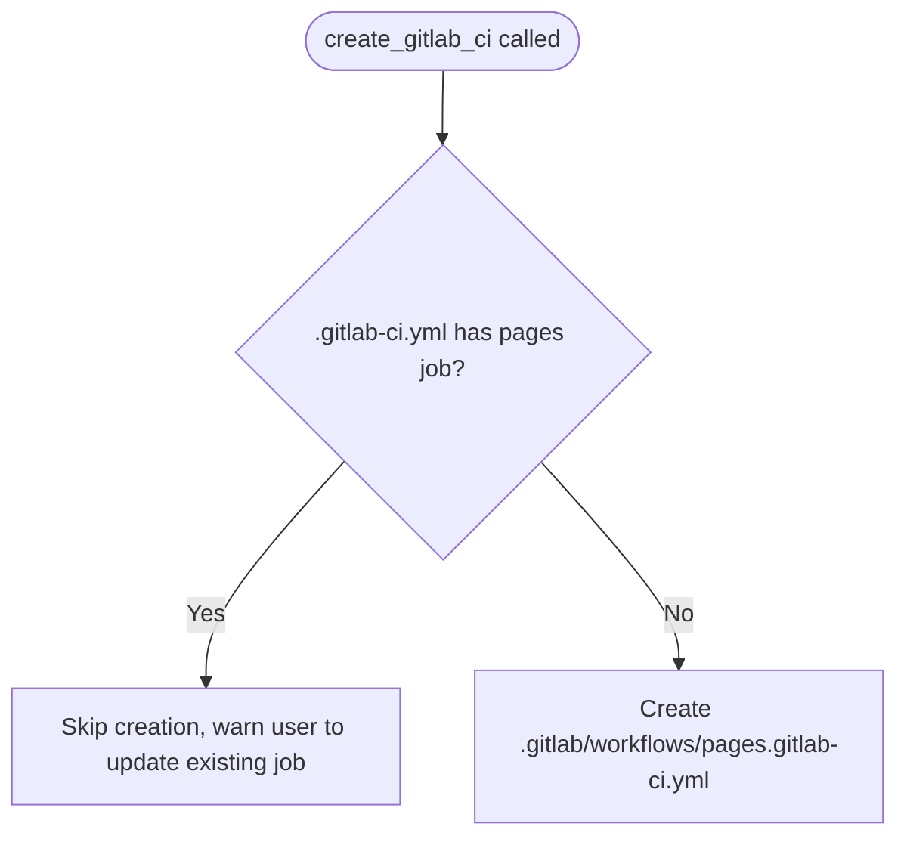
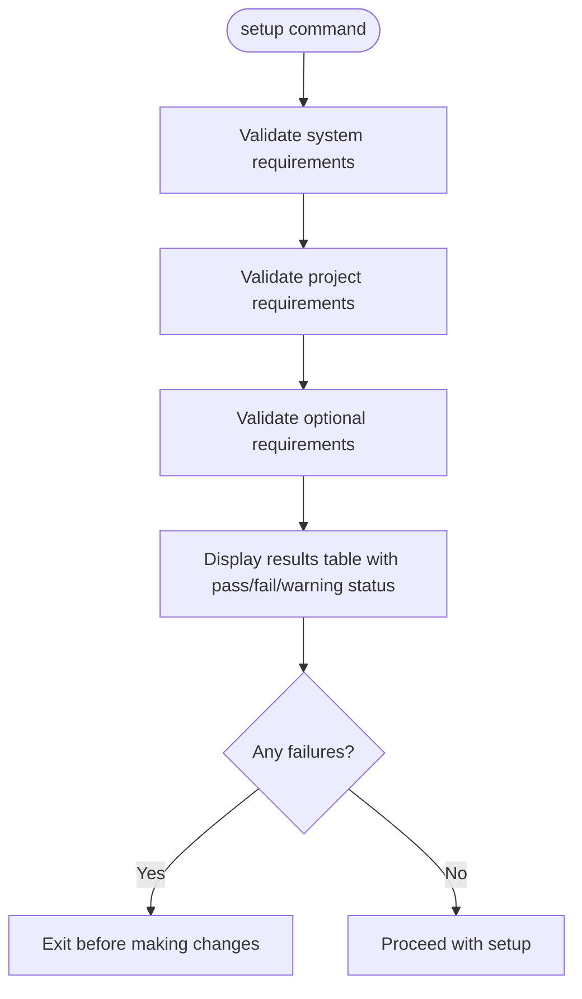

# mkapidocs - AI Agent Instructions

<identity>
mkapidocs: Installable Python package automating MkDocs documentation setup for Python projects. Supports GitHub Pages and GitLab Pages deployment with intelligent feature detection for C/C++ code and Typer CLI applications.
</identity>

<critical_requirements>

## Skill Loading (MANDATORY)



Orchestrator MUST load python3-development skill before any task.

Sub-agent prompts MUST include: "Enable mkdocs, hatchling, uv, and python3-development skills before starting."

</critical_requirements>

---

<architecture>

## Package Structure

```text
mkapidocs/
├── packages/mkapidocs/           # Main package
│   ├── __init__.py               # Package init with version
│   ├── cli.py                    # Typer CLI entry point
│   ├── builder.py                # Build/serve logic with environment detection
│   ├── generator.py              # Content generation and CI/CD setup
│   ├── validators.py             # Environment and project validation
│   ├── models.py                 # Pydantic models and enums
│   ├── yaml_utils.py             # YAML merge utilities
│   ├── version.py                # Version string
│   ├── templates/                # Jinja2 and static templates
│   │   ├── mkdocs.yml.j2         # MkDocs config template
│   │   ├── pages.yml             # GitHub Actions workflow
│   │   ├── gitlab-ci.yml         # GitLab CI workflow
│   │   └── *_template.py         # Markdown content templates
│   └── resources/                # Runtime resources
│       └── gen_ref_pages.py      # API docs generation script
├── tests/                        # Test suite
├── pyproject.toml                # Package configuration
└── README.md
```

## Module Responsibilities

- **cli.py**: Typer CLI entry point (commands: version, info, setup, build, serve)
- **generator.py**: Content generation, CI/CD workflow creation, feature detection, YAML merge system
- **builder.py**: Build/serve logic with target environment detection and uvx fallback
- **validators.py**: Environment and project validation with DoxygenInstaller
- **models.py**: CIProvider enum, MessageType enum, Pydantic models
- **yaml_utils.py**: Smart YAML merging utilities
- **templates/**: Jinja2 templates and static workflow files
- **resources/**: Runtime resources (gen_ref_pages.py copied to target projects)

## Template Rendering Flow



## Target Project Environment Integration

CLI documentation requires mkapidocs installed as dev dependency in target project. Enables mkdocs-typer2 to import CLI module with all dependencies.



</architecture>

---

<cli_interface>

## Commands

Pattern: `mkapidocs <command> [args]` or `uv run mkapidocs <command> [args]`

### version
Show version information.

```bash
mkapidocs version
```

### info
Display package metadata and installation details.

```bash
mkapidocs info
```

### setup
Configure MkDocs documentation and CI/CD workflows.

```bash
mkapidocs setup <path> [OPTIONS]
```

**Options:**
- `--provider {github|gitlab}` - Override provider auto-detection
- `--site-url URL` - Override all URL detection
- `--c-source-dirs DIRS` - C/C++ source directories (comma-separated)
- `--quiet, -q` - Suppress output (errors only)

**Provider Auto-Detection Logic:**



Supports enterprise instances (searches domain for keywords).

**Site URL Detection (GitLab):**



Requires `read_api` scope for API access.

**Examples:**

```bash
# Auto-detect provider from git remote or filesystem
mkapidocs setup /path/to/project

# Explicitly use GitHub Actions
mkapidocs setup /path/to/project --provider github

# Explicitly use GitLab CI
mkapidocs setup /path/to/project --provider gitlab

# Explicitly specify Pages URL (enterprise GitLab)
mkapidocs setup /path/to/project --site-url https://mygroup.pages.gitlab.example.com/myproject

# With GITLAB_TOKEN for API-based URL detection
GITLAB_TOKEN=glpat-xxx mkapidocs setup /path/to/project
```

### build
Build documentation to static site.

```bash
mkapidocs build <path> [OPTIONS]
```

**Options:**
- `--strict` - Fail on warnings
- `--output-dir PATH` - Custom output directory

**Example:**

```bash
mkapidocs build . --strict
```

### serve
Serve documentation with live preview.

```bash
mkapidocs serve <path> [OPTIONS]
```

**Options:**
- `--host HOST` - Bind host
- `--port PORT` - Bind port

**Example:**

```bash
mkapidocs serve .
```

</cli_interface>

---

<development_workflows>

## Prerequisites

Enable mkdocs skill at task start (this repo uses MkDocs for its own documentation).

## Linting and Formatting

```bash
# Ruff linter
uv run ruff check packages/mkapidocs/

# Ruff formatter
uv run ruff format packages/mkapidocs/

# Mypy type checker
uv run mypy packages/mkapidocs/

# Basedpyright type checker
uv run basedpyright packages/mkapidocs/
```

## Testing

```bash
# Run tests with coverage
uv run pytest

# Run specific test file
uv run pytest tests/test_cli_commands.py -v
```

## Running the Package

```bash
# Via uv run
uv run mkapidocs --help

# Test on example project
uv run mkapidocs setup /path/to/test/project
```

## Building This Project's Documentation

```bash
# Serve docs locally
uv run mkapidocs serve .

# Build static site
uv run mkapidocs build .
```

## Pre-commit Hooks

Configuration includes:

- **mkapidocs-regen**: Runs `mkapidocs setup .` to regenerate documentation when Python files, pyproject.toml, or mkdocs.yml change
- **Standard hooks**: trailing-whitespace, end-of-file-fixer, check-yaml, check-json, check-toml
- **Ruff**: Python linting and formatting
- **Mypy/Basedpyright**: Type checking
- **Shellcheck**: Shell script linting
- **Prettier**: YAML/JSON/Markdown formatting

</development_workflows>

---

<implementation_details>

## Git URL Detection

Extracts Pages URLs from git remotes.

**Handles:**
- SSH: `git@github.com:user/repo.git` or `git@gitlab.com:user/repo.git`
- HTTPS: `https://github.com/user/repo.git` or `https://gitlab.com/user/repo.git`

**Converts to:**
- GitHub Pages: `https://user.github.io/repo/`
- GitLab Pages: `https://user.gitlab.io/repo/`

## Source Path Detection

`get_source_paths_from_pyproject()` extracts package locations from pyproject.toml to set PYTHONPATH for mkdocstrings.

**Checks (in order):**
1. `[tool.hatch.build.targets.wheel]` with `packages` or `sources` mapping
2. `[tool.setuptools.packages.find]` with `where` key
3. Falls back to `src/`

## Doxygen Installer

Downloads and installs Doxygen for C/C++ documentation when absent.

**Process:**
- Downloads from official GitHub releases
- Verifies SHA256 checksum
- Extracts to `~/.local/bin/`
- Platform-specific (Linux x86_64 only currently)

## CLI Module Detection

Finds Typer CLI entry point for documentation generation.

**Process:**
1. Check `[project.scripts]` for entry points
2. Parse entry point format `module:app_object`
3. Fall back to common patterns if not found

## MkDocs Configuration Strategy

Generated mkdocs.yml is feature-conditional.

**Base plugins (always included):**
- search
- mkdocstrings (Python)
- mermaid2
- termynal

**Conditional plugins (based on detection):**
- `mkdocs-typer2`: Typer dependency found
- `mkdoxy`: C/C++ files found in source/
- `gen-files` + `literate-nav`: Auto-generated API docs

## Smart YAML Merge System

Non-destructive mkdocs.yml merging preserves user customizations.



**Preserved:**
- Custom navigation structure
- Additional plugins beyond template defaults
- Custom theme features
- Extra configuration sections
- User-added markdown extensions
- Custom site metadata

**Updated:**
- Plugin configurations (e.g., mkdocstrings handlers paths)
- Core plugin list (adds new feature-detected plugins)
- Template-managed default values

Allows users to customize docs and safely re-run setup for new features or template improvements.

</implementation_details>

---

<cicd_integration>

## GitHub Actions

Creates `.github/workflows/pages.yml`:

```yaml
# Workflow components (conceptual)
- actions/checkout@v4                      # Code checkout
- actions/setup-python@v5                  # Python 3.11 setup
- astral-sh/setup-uv@v4                    # uv installation
- uv run mkapidocs build . --strict        # Build documentation
- actions/upload-pages-artifact@v3         # Upload artifact
- actions/deploy-pages@v4                  # Deploy to GitHub Pages
```

Deploys on pushes to main branch only.

## GitLab CI

Creates `.gitlab/workflows/pages.gitlab-ci.yml`:

**Job: pages**
- Image: `ghcr.io/astral-sh/uv:python3.11`
- Command: `uv run mkapidocs build . --strict`
- Deploys: `public/` directory to GitLab Pages
- Trigger: Default branch only

**Pre-Creation Check:**



</cicd_integration>

---

<validation_system>

## Validation Checks



**System Requirements:**
- Python version
- uv installation
- mkdocs availability

**Project Requirements:**
- pyproject.toml exists
- Required metadata present

**Optional Requirements:**
- Doxygen for C code (offers to install)
- git for URL detection

Results displayed in rich tables.

</validation_system>

---

<error_handling>

## Error Strategy

**Validation errors:**
- Display detailed results table
- Exit before making changes

**Build/serve errors:**
- Capture subprocess output
- Display with rich formatting

**User-facing errors:**
- Use MessageType enum (INFO, SUCCESS, WARNING, ERROR)
- Display in rich panels

**Technical errors:**
- Raise CLIError or BuildError with context

</error_handling>

---

<file_generation>

## Content Generation Pattern

All generation functions follow this pattern:

1. Check if target file/directory exists
2. Render Jinja2 template with context variables
3. Write to target project (not this package's directory)
4. Display success message with rich formatting

</file_generation>

---

<template_modification>

## Working with Templates

**Template Locations:**

`packages/mkapidocs/templates/`

- `mkdocs.yml.j2`: Jinja2 template for MkDocs configuration
- `pages.yml`: Static GitHub Actions workflow template
- `gitlab-ci.yml`: Static GitLab CI workflow template
- `*_template.py`: Python modules with markdown content templates

**Modification Process:**

1. Edit appropriate template file in `packages/mkapidocs/templates/`
2. For Jinja2 templates (.j2): template variables come from feature detection in `generator.py`
3. Test by running `uv run mkapidocs setup` on sample project

</template_modification>

---

<code_quality>

## Standards

- **Python version**: 3.11+ (uses modern type hints with `|` unions)
- **Docstrings**: Google-style (enforced by ruff)
- **Type hints**: Required on all functions (mypy strict mode)
- **Line length**: 120 characters
- **Linting suppression**: Prohibited without fixing root cause

</code_quality>

---

<conventional_commits>

## Commit Message Format

Follows [Conventional Commits v1.0.0](https://www.conventionalcommits.org/en/v1.0.0/).

**Structure:**

```text
<type>[optional scope]: <description>

[optional body]

[optional footer(s)]
```

**Core Types (from spec):**
- **feat**: New functionality (MINOR version bump)
- **fix**: Bug fixes (PATCH version bump)

**Additional Types (allowed):**
- **docs**: Documentation changes
- **style**: Code style (formatting, whitespace)
- **refactor**: Code changes (neither fix bugs nor add features)
- **perf**: Performance improvements
- **test**: Adding or correcting tests
- **build**: Build system or dependency changes
- **ci**: CI configuration changes
- **chore**: Other changes (no src or test file modifications)

**Breaking Changes (MAJOR version bump):**

Two indication methods:
1. Add `!` after type/scope: `feat!: change API response format`
2. Add footer: `BREAKING CHANGE: detailed description`

**Rules:**
- Type is **mandatory**, followed by colon and space
- Description **must immediately follow** colon and space
- Description typically lowercase
- No period at end of description
- Body **must begin one blank line after** description
- Footer(s) one blank line after body
- `BREAKING CHANGE` **must be uppercase** in footer

**Examples:**

```text
feat: add user authentication support

feat(api): add pagination to list endpoints

fix: correct timezone handling in date calculations

docs: update installation instructions in README

refactor!: simplify error handling

BREAKING CHANGE: error responses now use standardized format
```

</conventional_commits>

---

<dependencies>

## Runtime Dependencies

Declared in `[project] dependencies` in pyproject.toml:

- **typer**: CLI framework
- **jinja2**: Template rendering
- **tomli-w**: TOML writing
- **python-dotenv**: Environment variables
- **pydantic**: Data validation
- **rich**: Terminal formatting
- **httpx**: HTTP client (Doxygen downloads)
- **pyyaml**: YAML parsing/writing
- **mkdocs + plugins**: Documentation generation

## Development Dependencies

Declared in `[dependency-groups] dev`.

</dependencies>
